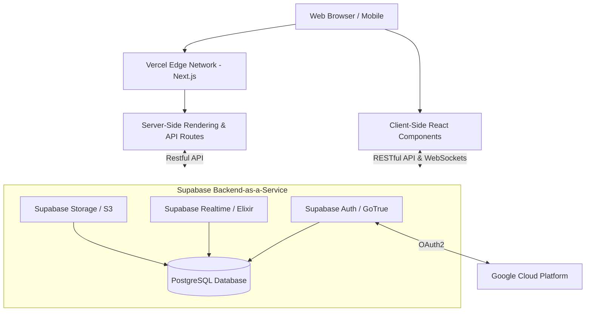
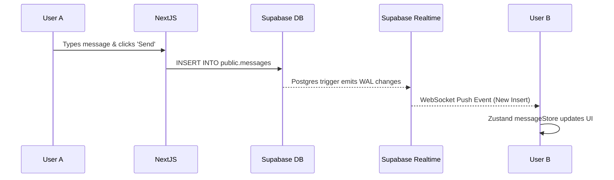

# ORMA System Architecture

This document provides a comprehensive overview of the system architecture for the ORMA peer-to-peer rental marketplace. It details the interaction between the frontend application, the backend data layer, external services, and the security model.

---

## 1. High-Level Architecture Pattern

ORMA utilizes a **Serverless / Backend-as-a-Service (BaaS)** architecture pattern. Instead of a traditional monolithic Node.js/Python server sitting between the frontend and the database, the Next.js frontend communicates directly with the Supabase PostgreSQL database via a secure, auto-generated REST/GraphQL API and WebSocket connections.

---

## 2. Frontend Architecture (Next.js App Router)

The frontend is built on **Next.js 16.2** utilizing the modern **App Router (`src/app`)** architecture.

### 2.1 Rendering Strategy
ORMA employs a hybrid rendering strategy to optimize for both SEO and highly interactive user experiences:
- **Server-Side Rendering (SSR):** Used for Listing detail pages (`/listing/[id]/page.tsx`). This ensures that web crawlers see the full HTML, Open Graph meta tags, and JSON-LD schema immediately, allowing rich previews when links are shared.
- **Client-Side Rendering (CSR):** Used for highly interactive components, complex forms (like the 7-Step Listing Wizard), and real-time chat.
- **Static Site Generation (SSG):** Used for informational pages (`/about`, `/faq`, `/terms`) that rarely change.

### 2.2 Component Hierarchy & Design System
- **Atomic Design Principles:** Components are categorized from basic UI elements (`components/ui`) to complex, composed features (`components/ListingCard.tsx`).
- **Tailwind CSS v4:** Styling is utility-first, enabling rapid development without massive CSS bundles. The design system is highly customized to mimic an **Apple-inspired aesthetic** (glassmorphism, subtle shadows, high border radii).
- **Framer Motion:** Handles all layout shifts, page transitions, and micro-interactions (like heart animation on wishlisting) seamlessly on the GPU.

### 2.3 State Management
Different scopes of state require different tools in ORMA:
1. **React Context (`AuthProvider`, `ThemeProvider`):** Global, low-frequency updates. Wraps the application to provide the current authenticated user and theme preference to all descendants.
2. **Zustand (`messageStore.ts`, `listingFormStore.ts`):** Global, high-frequency updates. Used for the real-time chat to prevent unnecessary re-renders across the app when a new message arrives, and for persisting data across the localized 7-step listing wizard.
3. **Local State (`useState`, `useReducer`):** Ephemeral UI state (e.g., dropdown open/closed status).
4. **URL State / Search Params:** Used for filtering and searching. The URL is the source of truth, enabling shareable specific search queries (e.g., `?category=cameras&city=Hyderabad`).

---

## 3. Backend Architecture (Supabase Engine)

The backend is entirely powered by **Supabase**. It provides a suite of tools tightly integrated with a core PostgreSQL database.

### 3.1 Data Layer (PostgreSQL)
The database structure is fundamentally relational, normalized to ensure data integrity.

**Core Entities:**
- `profiles`: The core user entity, linked automatically to Auth.
- `listings`: The rental items, belonging to a profile.
- `categories`: Static lookup table.
- `reviews`: Relational bridge between a renter, an owner, and a listing.
- `conversations` & `messages`: Normalization of the chat system.
- `wishlists`: Junction table for a many-to-many relationship.

### 3.2 Automated Logic (Triggers & Functions)
To keep the frontend thin and avoid race conditions, critical business logic is handled directly inside the database via PL/pgSQL functions bound to triggers:
- `on_auth_user_created`: When Supabase Auth detects a new signup, this trigger instantly creates a corresponding row in the `profiles` table.
- `on_review_change`: When a user leaves a review, the database automatically recalculates the `average_rating` and `total_reviews` columns on both the specific `listing` and the owner's `profile`.
- `notify_owner_on_review`: Inserts a notification record automatically when a review is added.

### 3.3 Security: Row-Level Security (RLS)
Because the Next.js client connects directly to the database, traditional endpoint security does not apply. Instead, security is applied at the table row level in PostgreSQL.

**Example Policy (Listings Table):**
- **Read:** `CREATE POLICY "Public profiles are viewable by everyone" ON profiles FOR SELECT USING (true);`
- **Write:** `CREATE POLICY "Users can insert their own profile." ON profiles FOR INSERT WITH CHECK (auth.uid() = id);`

This architecture entirely eliminates Broken Access Control vulnerabilities.

---

## 4. Authentication Flow Architecture

ORMA implements a highly secure, session-based authentication system using `@supabase/ssr` (Server-Side Rendering specific auth helpers).

1. **Client Request:** User clicks "Continue with Google" or signs in via Email/Password in `AuthModal.tsx`.
2. **Auth Service:** The request is sent to Supabase GoTrue service. For Google, the GoTrue service redirects to Google's OAuth consent screen.
3. **Callback Handling:** Google redirects back to `src/app/auth/callback/route.ts` with a secure access code.
4. **Session Establishment:** The Next.js API route securely exchanges the code for a JWT session tuple (Access Token, Refresh Token) on the server.
5. **Cookie Storage:** The session is stored in HTTP-only, secure cookies, preventing client-side JavaScript access (XSS defense).
6. **Provider Broadcast:** The `AuthProvider` context reads the session state and updates the UI (navbar avatar, permissions) universally across the app.

---

## 5. Realtime Messaging Architecture

The instant communication system is critical for a marketplace. ORMA utilizes Supabase Realtime (built on Elixir/Phoenix WebSockets).

- **Subscriptions:** When a user logs in, `messageStore.ts` connects to the WebSocket channel `custom-all-messages` and filters for events where their UUID is the `sender_id` or `receiver_id`.
- **Optimistic UI:** When sending, the message appears instantly on the sender's screen while the database request completes in the background.

---

## 6. Storage & Content Delivery

- **Image Uploads:** Handled on the client side via `react-dropzone`. Files are pushed directly to the Supabase Storage Edge network (bypassing the Vercel server limits).
- **Security:** The Storage bucket specifically allows only `.jpg`, `.png`, and `.webp` files, with a maximum size limit enforced via RLS policies.
- **Optimization:** The Next.js `<Image/>` component acts as a proxy, fetching the images from Supabase, compressing them to WebP, downsizing them based on viewport resolution, and caching them globally on Vercel's CDN.

---

## 7. Security Deep Dive

1. **Authentication:** JWTs with fast-expiring access tokens and secure refresh token rotation.
2. **Authorization:** 100% strict adherence to PostgreSQL Row Level Security (RLS).
3. **Cross-Site Scripting (XSS):**
   - User inputs (reviews, listing descriptions) are sanitized via `DOMPurify` before rendering.
   - React inherently escapes JSX bindings.
   - A strict `Content-Security-Policy` (CSP) header is defined in `next.config.ts`.
4. **Cross-Site Request Forgery (CSRF):** Since authentication relies on Authorization Bearer tokens via Supabase client (and secure Cookies for SSR), CSRF vectors are heavily mitigated.

---

## 8. Development & Build Tools

- **Local Dev:** `npm run dev` kicks off Next.js Turbopack for near-instant Hot Module Replacement (HMR).
- **TypeScript:** The entire stack is strongly typed, with types auto-generated from the Supabase Database Schema using the Supabase CLI (`npx supabase gen types typescript`).
- **Tailwind JIT:** The v4 engine dynamically creates CSS utility classes on demand.

## 9. Future Architecture Expansion (Roadmap)

To reach mature marketplace status, the architecture is designed to accommodate the following subsystems:

1. **Payment Gateway (Stripe Connect):** Will implement a secure webhook architecture. Stripe hooks will talk to Next.js API Routes, which using a Service Role Key, will bypass RLS to update invoice/booking tables securely.
2. **Elastic Search:** Moving from PostgreSQL `TSVECTOR` to a dedicated search index (Algolia / Meilisearch) for typo-tolerance and complex geo-spatial faceted searching.
3. **Transactional Email Engine:** Integration with Resend via Next.js server actions fired autonomously by Database Webhooks from PostgreSQL when specific table rows are updated.
